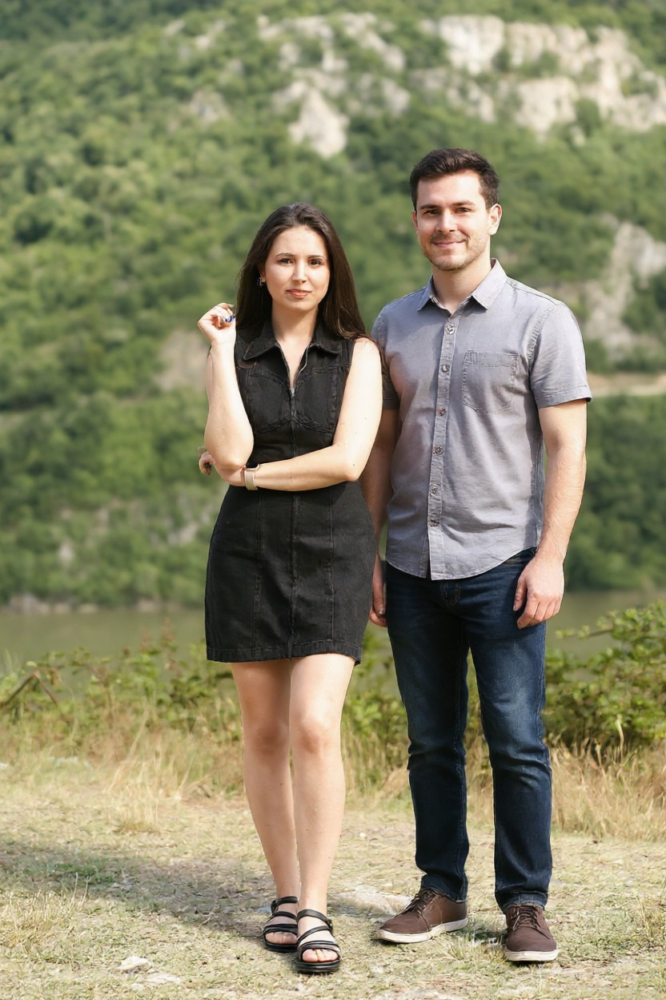
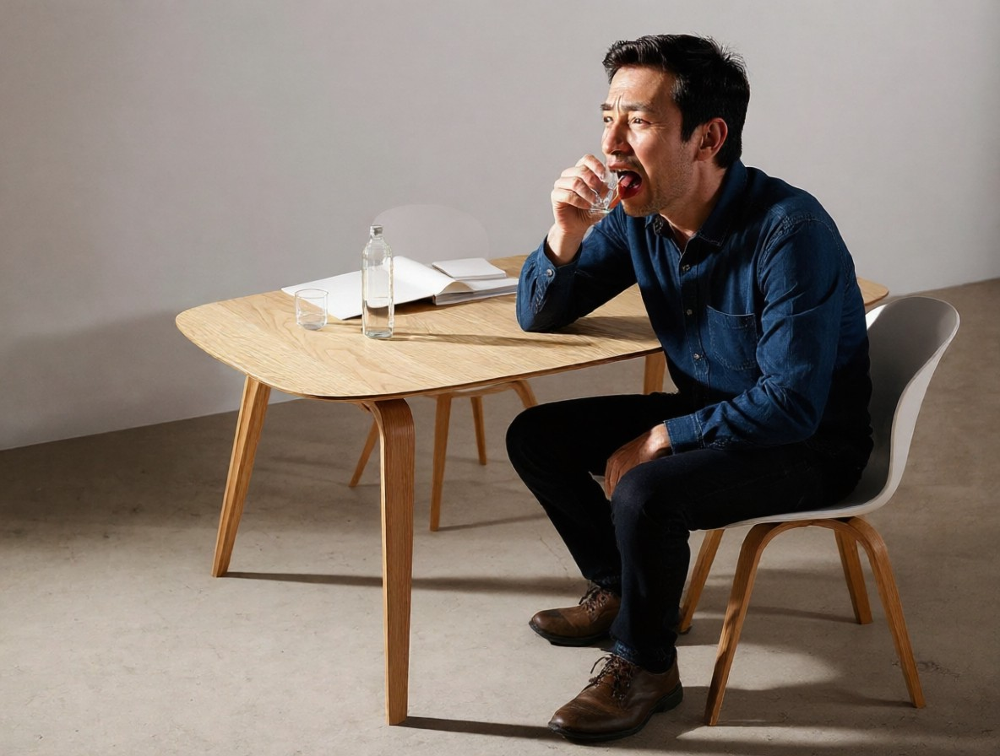

# AutoEdit Studio

AutoEdit Studio is a Streamlit-based prototype that explores a premium
image-editing workflow. The current milestone focuses on establishing a
polished front-end experience with a modular architecture that will welcome
future backend enhancements.

## Project layout

# AutoEdit Studio ✨

**Natural-language image editing through cascaded vision-language translation**

A proof-of-concept exploring how vision-language models can bridge the gap between casual user prompts and precise image editing instructions. Built by Sven Pfiffner as a research project.

---

## The Problem

Image editing models like QWEN-Image-Edit work great with specific instructions ("add sepia tone, reduce saturation"), but struggle with how people actually talk ("make it vintage"). If you feed vague prompts directly to diffusion models, they tend to reimagine the entire scene instead of editing what's there—changing subjects, hallucinating elements, losing the original composition.

## The Approach

This project uses a two-stage pipeline:

```
User Input → [JoyCaption Translation] → [QWEN Image Editing] → Output
  "make it vintage"  →  "add sepia tone, reduce     →  [edited image]
                         saturation, add film grain"
```

**Stage 1 - JoyCaption (LLaVA-based):** Looks at both your prompt and the actual image, then translates vague requests into 1-4 concrete, atomic edits. It's explicitly constrained to preserve faces, identities, composition, and pose unless you specifically ask to change them.

**Why this matters:** By breaking down abstract concepts into specific operations *before* diffusion, we prevent the model from going rogue. The edit modifies *the image*, not *a reimagining of it*. Subjects stay realistic, composition stays intact.

**Stage 2 - QWEN-Image-Edit:** Takes those specific instructions and applies them. Because it receives unambiguous directives, it can focus on targeted modifications while maintaining coherence.

---

---

## Examples

Comparison between our cascaded approach and vanilla QWEN-Image-Edit (4-bit):

| PROMPT | SOURCE | OURS | QWEN Image-Edit 4bit |
|--------|--------|------|---------------------|
| The woman looks lonely, add a friend next to her |  |  |  |
| Remove watermarks |  |  |  |
| Turn this kitten into a nerdy supervillain |  |  |  |
| The person occupying this table is really thirsty |  |  |  |
| Oh no! This woman seems to be cold, do something about it |  |  |  |

*Notice how our approach better preserves the original subject, composition, and realism while still applying the requested edits.*

---

## Current Status ⚠️

This is an **early proof of concept**. The core pipeline works and produces good results, but expect rough edges:
- No streamlined installation process yet (you'll need to manually install PyTorch, transformers, diffusers, etc.)
- Models download on first run (~20GB total)
- Bugs and edge cases exist
- Requires GPU with ~20GB VRAM

A stable release with proper packaging and documentation is coming soon. For now, this is a research prototype.

---

## Running It

If you want to try it anyway:

```bash
# Clone the repo
git clone https://github.com/SvenPfiffner/AutoEdit.git
cd AutoEdit

# Install dependencies (adjust for your CUDA version)
pip install streamlit pillow torch transformers diffusers accelerate

# Run the app
streamlit run src/autoedit/app.py
```

Models will download automatically on first run. Open the URL that appears, upload an image, and describe your edits naturally.

---

## Contributing & Citation

**Author:** Sven Pfiffner

Want to help improve this? Open an issue or fork the repo and submit a merge request. All contributions welcome! 🙌

If you use this in commercial work, academic research, or public projects, please cite:

```bibtex
@software{pfiffner2025autoedit,
  author = {Pfiffner, Sven},
  title = {AutoEdit Studio: Cascaded Vision-Language Image Editing},
  year = {2025},
  url = {https://github.com/SvenPfiffner/AutoEdit}
}
```